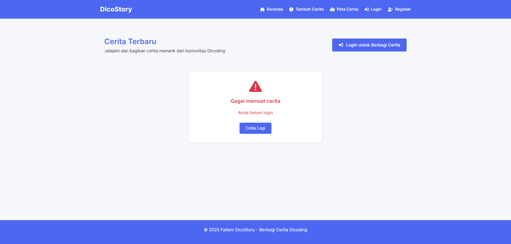
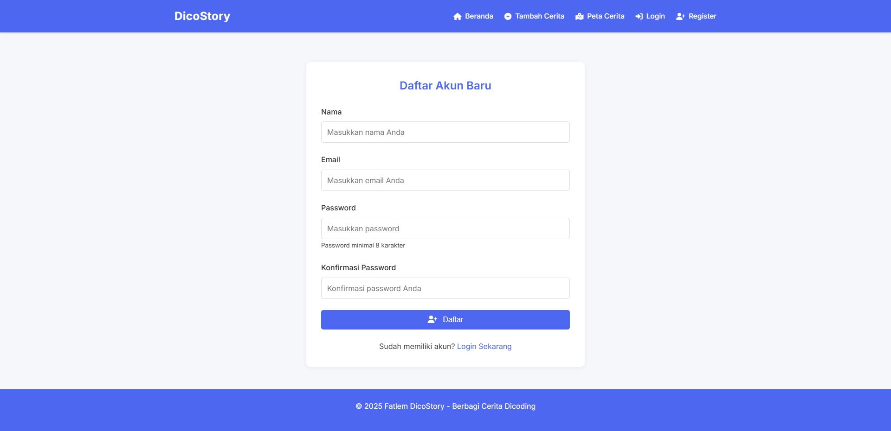
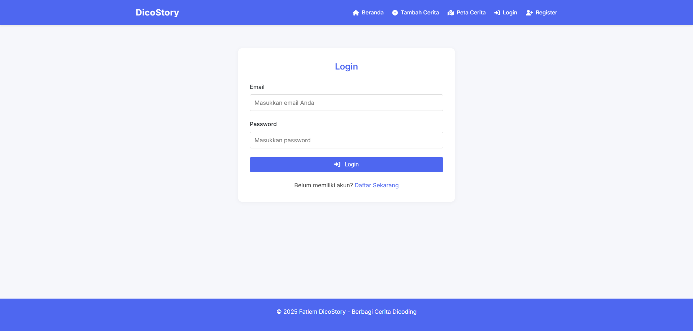
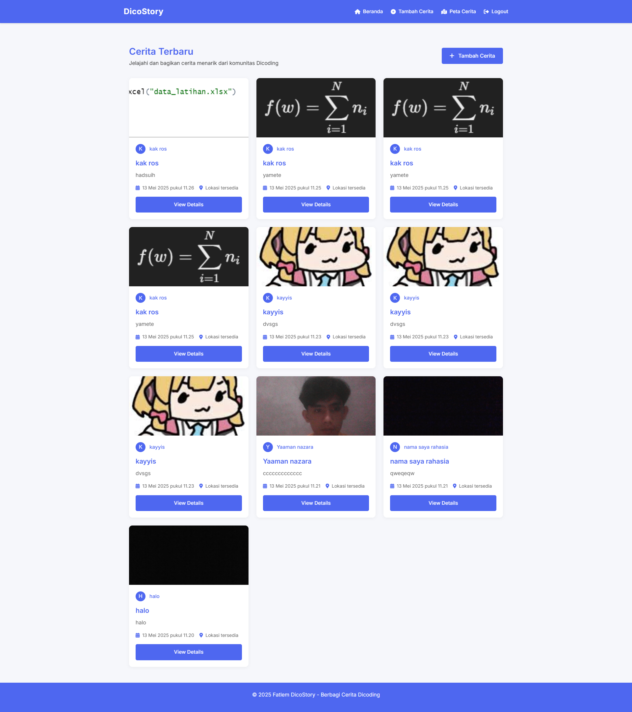
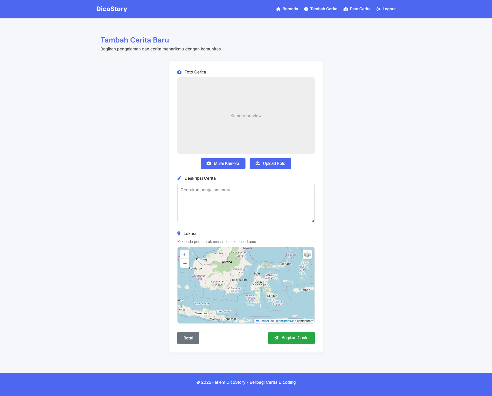
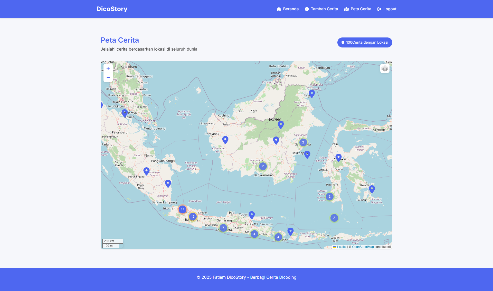

# Faathir El Tasleem - FC007D5Y1704

## 🚀 Aplikasi Cerita Digital

### 📌 **Catatan Penting**
Aplikasi ini menggunakan layanan peta dari **Leaflet** dengan **OpenStreetMap** sebagai provider.  
Tidak perlu API key khusus karena OpenStreetMap bersifat **gratis dan open source**.

#### 🌍 Untuk basemap tambahan:
- **Satellite View** - ArcGIS (tidak memerlukan API key untuk penggunaan dasar)
- **Topographic View** - OpenTopoMap (tidak memerlukan API key)

#### 🔔 Layanan push notification menggunakan API dari Dicoding dengan VAPID public key:
`BCCs2eonMI-6H2ctvFaWg-UYdDv387Vno_bzUzALpB442r2lCnsHmtrx8biyPi_E-1fSGABK_Qs_GlvPoJJqxbk`

---

### 🛠 **Fitur Aplikasi**

1. **Arsitektur Single-Page Application (SPA)**
   - Menggunakan teknik hash (#) untuk routing
   - Mengimplementasikan pola **Model-View-Presenter (MVP)**

2. **Menampilkan Data**
   - Daftar cerita dengan gambar dan informasi pada halaman utama
   - Detail cerita dalam modal tanpa menampilkan ID di URL
   - Peta digital untuk menampilkan lokasi cerita

3. **Menambah Data Baru**
   - Form untuk menambahkan cerita baru
   - Pengambilan gambar dengan kamera
   - Pemilihan lokasi dengan peta

4. **Aksesibilitas**
   - Skip to content link
   - Teks alternatif pada gambar
   - Label pada form inputs
   - Penggunaan **semantic elements** (header, nav, main, section, footer)

5. **Transisi Halaman**
   - Implementasi **View Transition API** untuk transisi halus antar halaman

6. **Fitur Tambahan **
   - Tampilan yang menarik dengan pemilihan warna dan layout yang baik
   - Mobile friendly dengan desain responsif
   - Kustomisasi transisi halaman dengan **Animation API**
   - Beragam gaya peta dalam layer control

---

### 📝 **Cara Penggunaan**

1. Buka aplikasi di browser
2. Register akun baru atau login jika sudah memiliki akun
3. Di halaman utama, lihat daftar cerita yang telah dibagikan
4. Klik tombol **"Tambah Cerita"** untuk membagikan cerita baru
5. Pada halaman tambah cerita:
   - Ambil foto dengan kamera 📸
   - Isi deskripsi cerita ✍️
   - Pilih lokasi pada peta 🌍
   - Klik **"Bagikan Cerita"**
6. Klik **"Peta Cerita"** untuk melihat semua cerita dengan lokasi pada peta

---

### 🖼 **UI/UX**

### **Lobby**

### **Register**

### **Login**

### **Home**

### **AddStory**

###  **Map**

---
